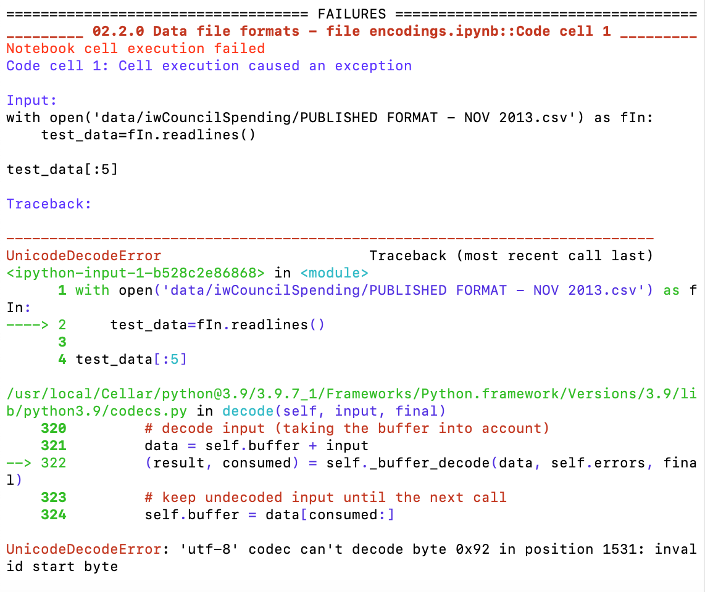
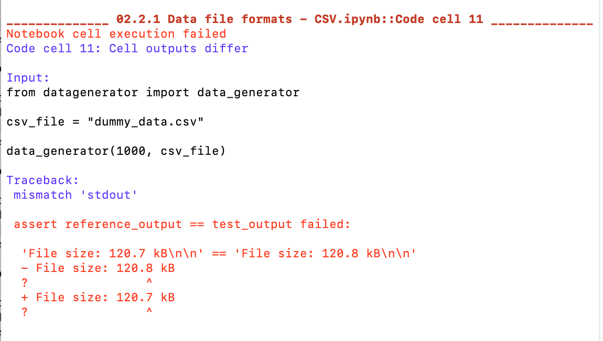

# Notebook Code Execution

In certain publication workflows, there may be a need to ensure that code execution integrity in notebooks is preserved as and when a code execution environment is updated.

For example, the code execution environment might have operating system package updates, or Python package updates, even if the notebooks are not the driving force behind the updates. In such cases, it is important to be able to test the notebooks to ensure that the package updates have not broken the notebooks, or started to raise warnings within them (such as deprecation warnings, for example).

This sort of testing is supported by the `nbval` package.

A second class of tests provided by the `testbook` package corresponds more closely to functional unit testing. In this case, a test file lists test that can then be run against functions defined in one or more other notebooks. This sort of testing is useful if notebook code is updated and the functional / behavioural integrity of functions defined by the code needs to be preserved.

## The `nbval` Notebook Code Testing Framework

The [`nbval`](https://nbval.readthedocs.io/en/latest/) Python package provides an extension to the widely used [`pytest`](https://docs.pytest.org/) framework that allows notebook code cell execution to be tested against a set of reference code cell outputs.

A notebook is saved with all cells run and used as a reference notebook. When an update is made to the code execution environment, `nbval` can be used to re-run all notebook cells and compare them to the original cell outputs.

In the [original `nbval` package](https://github.com/computationalmodelling/nbval), cell tags can be used to ignore certain cells outputs (`nbval-ignore-output`), identify cells that raise errors (`nbval-raises-exception` / `raises-exception`), or omit the running of the cell altogether (`nbval-skip`).

A [forked version of `nbval`](https://github.com/ouseful-PR/nbval/tree/table-test) provides a range of additional cell tags that recognises the following additional tags:

- `folium-map`: specify that the cell is a folium map output. The cell output is then ignored as per `nbval-ignore-output`;
- `nbval-variable-output`: some cells return randomised or changeable output that cannot be easily sanitised using a regular expression. The output of cells tagged with `nbval-variable-output` are ignored as per `nbval-ignore-output`;
- `nbval-count-lines`: where cells contain printed output that changes in content but not structure (for example, the same number of lines are printed on each run), the `nbval-count-lines` will check that the same number of lines are printed by a cell in the test notebook as in the reference notebook;
- `nbval-test-df` tag: if a cell returns a *pandas* dataframe, check that the test dataframe has a similar structure to the reference dataframe, even if the content differs. Structural tests currently include: shape test (same number of rows and columns; common column names test);


- `nbval-test-listlen` tag: perform a structural comparison of the list length of a Python list output;
- `nbval-test-dictkeys` tag: perform a structural comparison of the sorted keys of a Python dictionary output.

Regular expression mapping can also be used to map particular outputs. For example, if a cell were to return a timestamp as part of an output message, this would typically be guaranteed to fail (the test generated timestamp would differ from the reference timestamp). However, a regular expression mapping could be used to map the reference time stamp to a `REFERENCE_TIME` string label, for example, which would allow the cell outputs to otherwise match.

```text
%%writefile SANITISE.cfg
[regex1]
regex: \d{1,2}/\d{1,2}/\d{2,4}
replace: DATE-STAMP

[regex2]
regex: \d{2}:\d{2}:\d{2}
replace: TIME-STAMP
```

The sanitise file ca then be called with the `--sanitize-with SANITISE.cfg` switch.

The `nbval` notebook code checker can be run against one or more notebooks from the command line: `py.test --nbval $FILEPATH`

The initial report provides a streamed summary of cell test passes/fails at notebook level:


Errors are then reported in more detail on a per cell basis. For example, erroring cells will natively raise an `nbval` test error (although a cell tag can be used to ignore these).



Errors we are more likely to want to catch are cell output mismatch errors that are "legitimate" and that either need fixing, or that may require the original reference notebook to be rerun.



Ideally, notebooks should be tagged or regex mapped in such a way as to ensure that all tests pass but that as many cells are possibly are properly tested.

This form of testing is useful when checking that notebook execution is not affected by changes to the execution environment.

## Code Cell Tests With `testbook`

Another approach to cell tests comes in the form of [`testbook`](https://github.com/nteract/testbook). This is perhaps more akin to traditional unit testing, in the sense that one or more unit tests are written in one notebook and then applied to functions or variables defined by the execution of code in a notebook under test.

```python
from testbook import testbook

@testbook('/path/to/notebook.ipynb', execute=True)
def test_func(tb):
   func = tb.get("func")

   assert func(1, 2) == 3
```

The `execute` parameter can be used to assert whether all notebook cells should be executed before a test is run, whether one more specific cells should be executed, or whether a range of contiguous cells should be executed.

This form of testing is useful for ensuring that the behavioural integrity of functions or cells defined in notebook are not affected by updates to the code.
